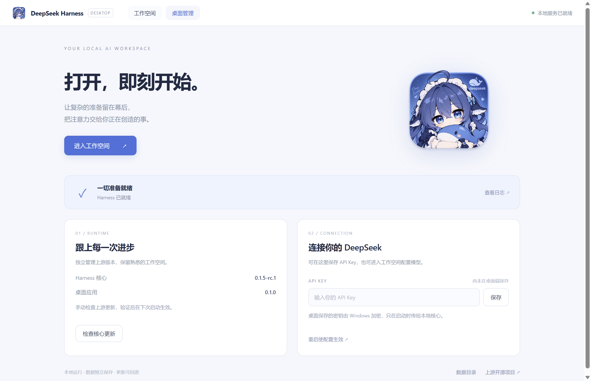

# DeepSeek Harness Desktop

独立的 Windows 桌面封装：点击图标自动启动 [DeepSeek Harness](https://github.com/deepseek-ai/deepseek-harness)，使用上游 Web UI，内置 Node.js 与固定版本核心。



## 使用

当前桌面版本为 0.2.3，本地安装包为 `release/DeepSeek-Harness-Desktop-0.2.3-Setup.exe`。安装后打开桌面快捷方式；尚未发布到远程 Releases。

- **工作空间**：上游原生会话、工作区、模型及插件界面。
- **桌面管理**：服务状态、API Key 加密保存、核心版本检查、诊断日志和数据目录。
- 首次使用按上游引导选择工作区并配置模型。通过桌面保存的 DeepSeek API Key 在重启后生效。
- 上游更新下载到隔离目录，校验包完整性并试启动；重启后备份数据再切换。失败自动恢复，成功后也可手动回退。
- **联网搜索**：默认使用 Exa Search MCP 的免费通道，不依赖 DeepSeek API Key 或余额；Exa 自身仍有免费限流。网页读取继续使用上游 HTTP 后端。
- **地区错误恢复**：遇到包含 `User location is not supported for the API use` 和 `FAILED_PRECONDITION` 的模型错误，且尚未收到任何流事件时，等待 1 秒、2 秒分别补试，最多两次。已有文字、思考、工具调用或其他流事件、用户取消、其他错误均不会触发该补试。

本项目是社区封装，不是 DeepSeek 官方桌面发行版。图标由项目所有者提供。

## 用量统计与成本（0.2.3）

当前源码新增独立「用量统计」页面：总览、每日趋势、模型筛选、会话搜索与排序、逐轮明细，以及打开原会话。支持 Token 总成本估算、可编辑单价、models.dev 在线价格同步及本机 cc-switch 价格文件同步。自定义单价不被同步覆盖，未上报用量及缺失价格明确标注，不混入上下文估算或订阅额度。功能口径与验收方法见 [用量统计说明](docs/usage-dashboard.md)。此功能已纳入 0.2.3 本地构建。

含成本统计和价格同步的本地 Windows 预览分发目录位于 `release/cost-preview/win-unpacked/`，入口为其中的 `DeepSeek Harness Desktop.exe`；完整目录需要一起保留。与安装版使用相同的应用数据目录和单实例管理。先结束当前任务并退出旧版，再打开预览版。

## Agent 协作（0.2.2 接入验证版）

协作服务 0.3.0 新增长任务入口：给定目标、验收条件、固定检查命令、轮次和截止时间后，后台原生 Codex 自动规划与审核，Harness 执行，检查结果进入下一轮判断。发起端断开后仍可继续；不会自动合并，也不会唤醒当前聊天窗口。使用方法与边界见 [长任务闭环](docs/long-running-collaboration.md)。协作功能保持原有接入方式，桌面壳现为 0.2.3。

独立本机协作服务让规划 Agent 通过 MCP 派发任务，在隔离 worktree 中执行、返回事件和改动，再审核与定向修订。本机 0.2.2 已正式安装，当前 Codex 任务已直接完成真实派发、结果回传、测试审核和同会话修订，两轮共用安装版桌面内的同一原生 Agent。旧 Community 版本的长路径卸载问题已通过可恢复的安装记录修正解决。ZCode 的原版新会话验证仍未通过，目前按用户要求优先交付 Harness 通信，详情见验收记录。

本机 Codex MCP 配置已注册，当前任务已加载并实际调用八个工具。具体状态见 [Codex 接入记录](docs/codex-collaboration-connection.md)、[MCP 使用说明](docs/collaboration-mcp.md)、[协作验收](docs/collaboration-validation.md)。入口随运行时打包，需要 Git；真实模型任务使用原生账户额度。

```powershell
npm run collaboration -- --allow-root D:\code\Deepseek-harness-destop --list-executors
npm run smoke:collaboration -- --live
```

## 开发与打包

Windows x64，Node **24.18.0**。

```powershell
npm ci
npm run prepare:runtime
npm start
npm test
npm run smoke
node scripts/integration-smoke.cjs
node scripts/ui-smoke.cjs
npm run dist
node scripts/ui-smoke.cjs --packaged
```

`prepare:runtime` 使用 `harness-lock.json` 安装固定核心依赖，复制当前 Node 与 npm，并生成图标。运行文件均位于被 Git 忽略的 `runtime/`；新仓库不包含上游源码历史。安装包位于 `release/`。

## 数据与更新

用户数据保存在 Electron 的用户数据目录（通常为 `%APPDATA%/deepseek-harness-desktop`，通过应用内“数据目录”打开准确路径）。Harness 使用其下独立的 `harness-home`，不会自动读取或迁移旧版 `~/.dsh`。

桌面保存的 API Key 位于 `credential.bin`，通过 Electron safeStorage 使用 Windows 加密；传给本地子进程的环境变量为 `DEEPSEEK_API_KEY`。上游界面自行保存的凭据遵循上游存储机制。

更新来源固定为 npm 官方注册表的 `@deepseek-ai/dsh`。桌面显示的核心版本与桌面版本独立。首版支持核心更新；桌面壳自身通过新安装包升级。上游尚处于预览期，启动验证不能保证所有插件或模型能力兼容。

回退将当前数据另存为 `recovered-data-*`，再恢复升级前快照。回退后新产生的会话不会自动合并；原文件仍保留，可手动恢复。

## 首版验证范围

已覆盖的检查及剩余边界见 [验收记录](docs/validation.md)，进程和更新设计见 [架构说明](docs/architecture.md)。没有 API Key 的测试不调用付费模型，不声称已完成真实模型应答验收。
